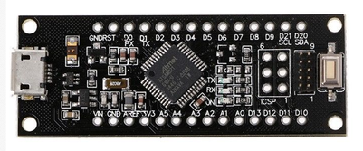

<div class="blog-date">2024-06-23</div>

# Getting started with a SAMD21 M0-Mini

This is a guide on how to get started with a SAMD21 M0-Mini board. The board is a small development board with a [SAMD21 microcontroller from Microchip](https://developerhelp.microchip.com/xwiki/bin/view/products/mcu-mpu/32bit-mcu/sam/samd21-mcu-overview/).


## Arduino IDE - pre-requisites

Following the information here: https://github.com/BLavery/SAMD21-M0-Mini#arduino-ide
Done on a Mac Sonoma 14.5, Arduino IDE 1.8.19, but should work on other platforms.

1. Arduino IDE: Install the board: _Tools -> Board -> Boards Manager_
   Search for "SAMD" and install the board "Arduino SAMD Boards (32-bits Arm Cortex-M0+) by Arduino."

### Blink Example

1. Arduino IDE: Load the blink example: _File -> Examples -> 01.Basics -> Blink_
2. Arduino IDE: As mine board missed the builtin LED, but has a RX LED (pin 25) and TX LED (pin 26), I added this to the sketch before `void setup()`:
   ```cpp
   #define LED_BUILTIN 25  // RX LED
   ```

## Uploading the sketch

1. Connect the board via USB. The board's ON LED should light up (mine was green).
   The computer should detect it (on Mac it asked for permissions to use the USB device).
2. Arduino IDE: Select the board: _Tools -> Board -> Arduino SAMD (32-bits Arm Cortex-M0+) -> Arduino Zero (Native USB Port)_
3. Double click the reset button on the board to enter bootloader mode, and click the _Upload_ button in the Arduino IDE.
   The sketch should upload, and after it has auto resetd, the RX LED should start blinking (mine wasn't bright at all).

## Update with UF2 bootloader (that supports drag-and-drop)

Adafruit has forked Microsoft's UF2 bootloader and updated it for SAMD21. This bootloader allows you to drag-and-drop a compiled sketch to the board. Adafruit has created a bootloader for Arduino Zero, which can be used as a base for the SAMD21 M0-Mini, however the LED_PIN should be PIN_PA27 and LED_TX_PIN and LED_RX_PIN should be undefined.
The process is described here: https://github.com/BLavery/SAMD21-M0-Mini#bootloaders-again

I've created a repo that does this and builds the bootloader for the SAMD21 M0-Mini, and prebuild bootloader can be downloaded here: https://github.com/HCanber/uf2-samdx1-samd21-m0-mini/releases.
That repo contains a [samd21-m0-mini](https://github.com/HCanber/uf2-samdx1-samd21-m0-mini/tree/samd21-m0-mini) branch with the necessary changes and a [workflow](https://github.com/HCanber/uf2-samdx1-samd21-m0-mini/blob/samd21-m0-mini/.github/workflows/samd21-m0-mini.yml) that builds the bootloader and creates a release.

To install the bootloader:

1. Download the file ending with `.ino` from the [release page](https://github.com/HCanber/uf2-samdx1-samd21-m0-mini/releases).
2. Open the file in the Arduino IDE and use it as a sketch.
3. Upload the sketch to the board (see above).

After the bootloader is installed, the board should show up as a USB drive when connected to the computer after the reset button is double clicked. You can then drag-and-drop a compiled sketch to the board, or you can use the Arduino IDE to upload the sketch.
