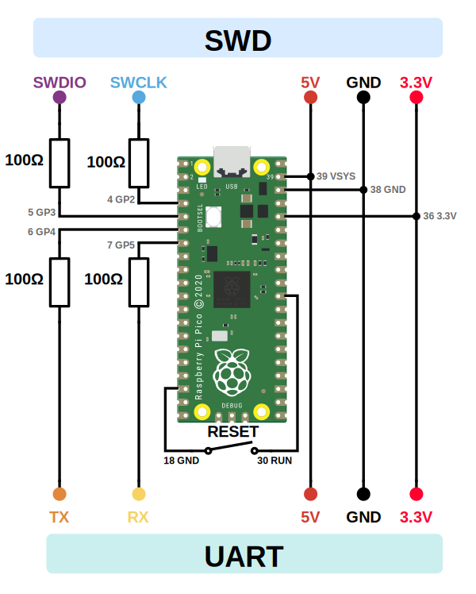

2024-07-18

# Raspberry Pi Pico as SWD programmer

The Raspberry Pi Pico can be used as a CMSIS-DAP debugger. This is useful when you need to debug a board that has a SWD interface but you don't have a debugger at hand.
This is how you to install a firmware on a Pico to turn it into a USB → SWD and UART converter

## Install the debugger firmware

1. Download `debugprobe_on_pico.uf2` from https://github.com/raspberrypi/debugprobe/releases
2. On the Pico push and hold <kbd>BOOTSEL</kbd> pressed while connecting it to the computer.
   It will be detected as a USB drive called `RPI-RP2`
3. Copy `debugprobe_on_pico.uf2` to the Pico
4. Once it finishes, the Pico will restart and identify itself as a CMSIS-DAP debugger
5. On a Mac:
   - To list the device on a Mac, run `ls /dev | grep usb`
   - To show information about the device, run `system_profiler SPUSBDataType`

## Connect the Pico to the target using SWD

Connect the Pico to the target board using jumper wires

- SWDIO to GP3
- SWCLK to GP2
- GND to GND (any GND pin will do)
- 3.3V to 3.3V (unless the board needs 5V then you use that)

Based on https://datasheets.raspberrypi.com/pico/getting-started-with-pico.pdf

The 100Ω resistors are recommended but not strictly required.

> “The resistors provide some slew limiting (better for signal integrity and EMC), short-circuit and ESD current limiting. Note that the 100R resistors at the target are not strictly required but highly recommended unless the platform is very low cost and/or space constrained.
> The series resistors will limit the maximum speed of the interface, however over a few 10s of CM of cable and PCB ~30MHz performance should still be achievable.”
> From [Raspberry Pi 3-pin Debug Connector Specification](https://datasheets.raspberrypi.com/debug/debug-connector-specification.pdf)

## Flash a nice!nano V2 nrF52840 board

See [this blog post](blog/2024-07-19-pico-swd-nrf52840) for how to flash a nice!nano V2 board using the Raspberry Pi Pico
