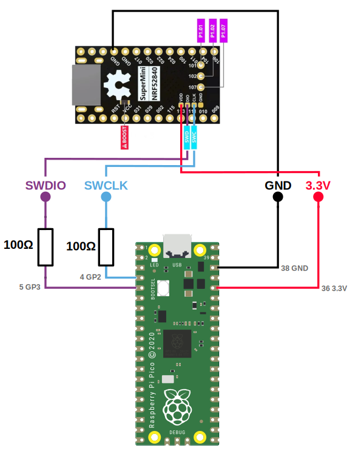

<div class="blog-date">2024-07-19</div>

# Program nice!nano V2 clone with RPI Pico

The cheap nice!nano V2 clones sometimes comes without a bootloader, so it will not show up as a USB device when connected.

This is how you can flash a bootloader using a Raspberry Pi Pico as a SWD debugger. This will also with the original nice!nano V2, but shown on the pictures is the cheap

1. Prerequisites:
   1. Install xpm, see https://xpack.github.io/xpm/install/
   1. Create a directory and cd in to it
      ```sh
      mkdir nice-nano
      cd nice-nano
      ```
   1. Initialize xpm and install OpenOcd
      ```sh
      xpm init
      xpm install @xpack-dev-tools/openocd@latest --verbose
      ```
      More info: https://xpack.github.io/dev-tools/openocd/install/
   1. Make sure your Raspberry Pi Pico has the debugger firmware installed, see [previous blog post](blog/2024-07-18-raspberry-pi-pico-as-swd.md)
1. Download the [bootloader hex](https://nicekeyboards.com/assets/nice_nano_bootloader-0.6.0_s140_6.1.1.hex)
   This link was found on the [Nice Nano 2 Troubleshooting page](https://nicekeyboards.com/docs/nice-nano/troubleshooting)
1. Connect the Pico to the Nice Nano 2 clone according to the schematics below
   
   The 100Ω resistors can be omitted, see [previous blog post](blog/2024-07-18-raspberry-pi-pico-as-swd.md)
1. Insert the Pico in to the computer using a USB cable
1. Execute this command. First it unlocks the device, using the `nrf52_recover` command, it then flashes the bootloader.
   Note! Specify the path to the downloaded hex file. The command below assumes the hex file is in the same directory as the command is executed from (`nice-nano` directory).

   ```sh
   openocd -f interface/cmsis-dap.cfg -f target/nrf52.cfg  \
     -c "gdb_flash_program enable"  \
     -c "gdb_breakpoint_override hard"  \
     -c "init"  \
     -c "nrf52_recover"  \
     -c "reset halt"  \
     -c "flash write_image erase ./nice_nano_bootloader-0.6.0_s140_6.1.1.hex"
   ```

   Note! the command should be on one line, it is split here for readability. If executing on Windows, remove the backslashes.

   The output should look something like this:

   ```
   Open On-Chip Debugger 0.12.0-rc2+dev-00028-g9501b263e-dirty (2022-12-04-03:23)
   Licensed under GNU GPL v2
   For bug reports, read
     http://openocd.org/doc/doxygen/bugs.html
   Info : auto-selecting first available session transport "swd". To override use 'transport select <transport>'.
   force hard breakpoints
   Info : Using CMSIS-DAPv2 interface with VID:PID=0x2e8a:0x000c, serial=E66058388329B42E
   Info : CMSIS-DAP: SWD supported
   Info : CMSIS-DAP: Atomic commands supported
   Info : CMSIS-DAP: Test domain timer supported
   Info : CMSIS-DAP: FW Version = 2.0.0
   Info : CMSIS-DAP: Interface Initialised (SWD)
   Info : SWCLK/TCK = 0 SWDIO/TMS = 0 TDI = 0 TDO = 0 nTRST = 0 nRESET = 0
   Info : CMSIS-DAP: Interface ready
   Info : clock speed 1000 kHz
   Info : SWD DPIDR 0x2ba01477
   Info : [nrf52.cpu] Cortex-M4 r0p1 processor detected
   Info : [nrf52.cpu] target has 6 breakpoints, 4 watchpoints
   Info : starting gdb server for nrf52.cpu on 3333
   Info : Listening on port 3333 for gdb connections
   Waiting for chip erase...
   nrf52.cpu device has been successfully erased and unlocked.
   Error: [nrf52.cpu] clearing lockup after double fault
   Info : [nrf52.cpu] external reset detected
   [nrf52.cpu] halted due to debug-request, current mode: Thread
   xPSR: 0x01000000 pc: 0xfffffffe msp: 0xfffffffc
   Info : nRF52840-xxAA(build code: D0) 1024kB Flash, 256kB RAM
   Info : Padding image section 0 at 0x00000b00 with 1280 bytes
   Info : Flash write discontinued at 0x00025de8, next section at 0x000f4000
   Warn : Adding extra erase range, 0x00025de8 .. 0x00025fff
   Info : Padding image section 2 at 0x000fc658 with 4520 bytes
   Warn : Adding extra erase range, 0x000fd858 .. 0x000fdfff
   Warn : Adding extra erase range, 0x10001000 .. 0x10001013
   Warn : Adding extra erase range, 0x1000101c .. 0x10001fff
   auto erase enabled
   wrote 194120 bytes from file ./nice_nano_bootloader-0.6.0_s140_6.1.1.hex in 9.258425s (20.475 KiB/s)

   Info : Listening on port 6666 for tcl connections
   Info : Listening on port 4444 for telnet connections
   ```

1. Press <kbd>CTRL-C</kbd> to terminate the openocd session
1. The nice!nano V2 clone should contain the bootloader, and should show up as a USB device when connected to the computer.
